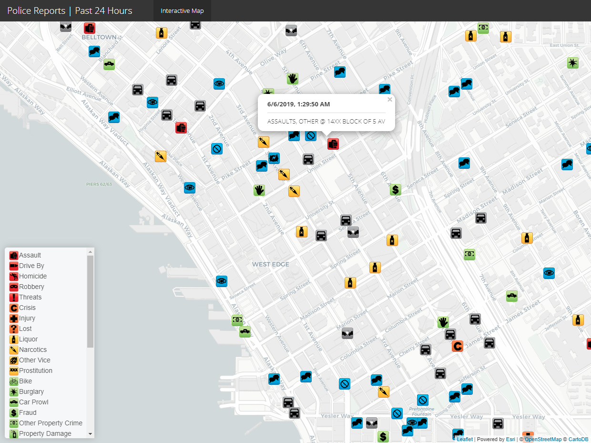
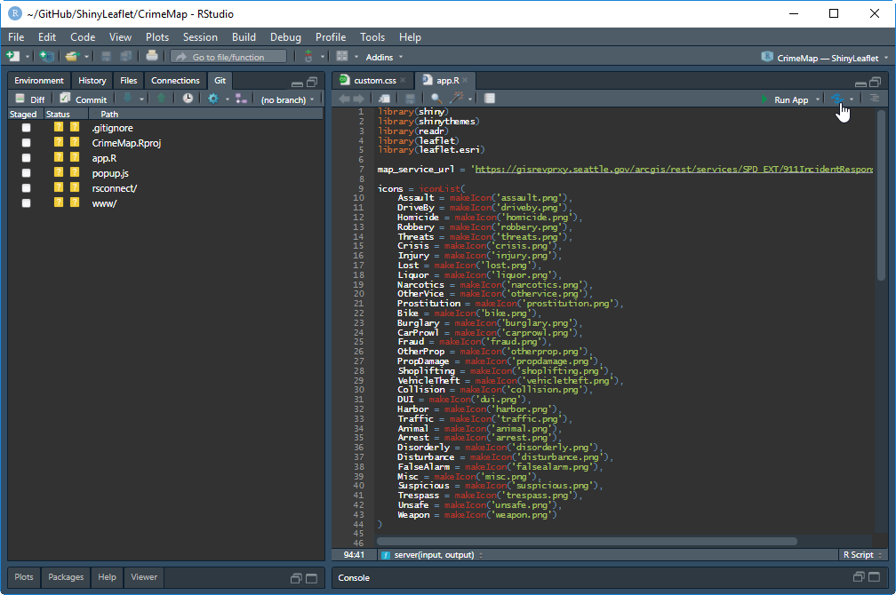
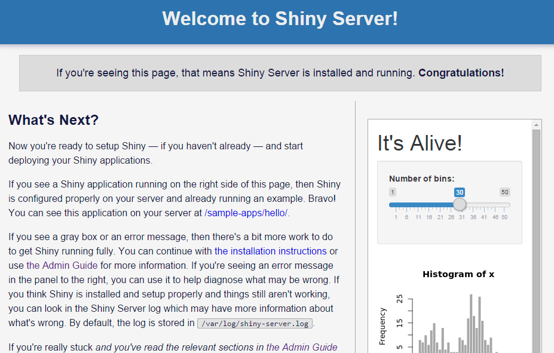
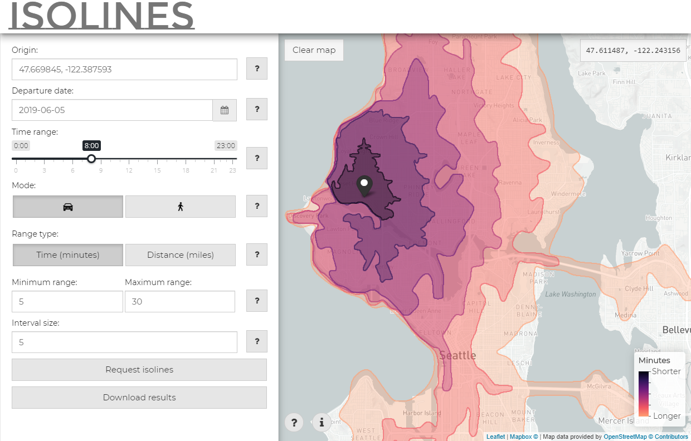

class: split-70 hide-slide-number
background-image: url('images/leaves.jpg')
background-size: cover

.column.slide-in-left[
.sliderbox.vmiddle.shade_main.center.content[
  # Working with GIS Data]]
.column[
]

<!-- --------------------------------------------------------------------------------------------------------------- -->

---

layout: false
class: split-33 with-thick-border

.column.bg-main1[.content[
  # Shapefiles
]]

.column[.content[
# 
  * Very common spatial data format
  * Originally developed by Esri
  * Supported by commercial and open-source GIS products
  * Supports three types of spatial data:
    + Points
    + Lines
    + Polygons
  * A shapefile is a bit of a misnomer because it's actually a collection of files including a `.shp`, `.shx`, `.prg` and `.dbf` file
  * Use `rgdal::readOGR` or `sf::st_read` to read from a shapefile
```{r, echo = TRUE, eval = FALSE}
# download and extract traffic flow data
url = 'https://opendata.arcgis.com/datasets/170b764c52f34c9497720c0463f3b58b_9.zip'
tmp = tempfile()
download.file(url, tmp)
unzip(tmp, exdir = tempdir())
# read spatial data using either readOGR or st_read
x = sf::st_read(dsn = tempdir(), layer = '2016_Traffic_Flow_Counts', quiet = TRUE)
```
]]

<!-- --------------------------------------------------------------------------------------------------------------- -->

---

layout: false
class: split-33 with-thick-border

.column.bg-main1[.content[
  # GeoJSON
]]

.column[.content[
# 
  * A special flavor of JSON that also encodes coordinate information
  * Natively open-source and tailored to work on the web
  * Rather verbose, difficult to handle large datasets, generally works well for datasets less than 4MB
  * Use `rgdal::readOGR` or `sf::st_read` to read from a geojson file
```{json}
{
  "type": "Feature",
  "geometry": {
    "type": "Point",
    "coordinates": [-122.387250, 47.669827]
  },
  "properties": {
    "name": "Home"
  }
}
```

```{r, echo = TRUE, eval = FALSE}
url = 'https://opendata.arcgis.com/datasets/170b764c52f34c9497720c0463f3b58b_9.geojson'
# read spatial data using either readOGR or st_read
x = sf::st_read(url, quiet = TRUE)
```
]]

<!-- --------------------------------------------------------------------------------------------------------------- -->

---

layout: false
class: split-33 with-thick-border

.column.bg-main1[.content[
  # Map services
]]

.column[.content[
# 
  * Many federal, state, regional and municipal agencies host their GIS data as map services exposed via a RESTful API
  * Map services can be included into any web map and removes the burden of hosting and updating GIS data
  * Map services support point, polyline, polygon and raster features
  * Services can be removed or changed with no warning, so if you value stability over currency, consider hosting layers internally
  * Responses are typically limited to 1000 features in a single request, add a filter to a request or limit the visible scale range to avoid running into this limitation and potentially misrepresenting data
]]

<!-- --------------------------------------------------------------------------------------------------------------- -->

---

layout: false
class: split-33 with-thick-border

.column.bg-main1[.content[
  # Other formats
]]

.column[.content[
# 
  * Geodatabase (.gdb)
    + Quite common
    + Proprietary spatial data format by Esri
  * KML/KMZ
    + Less commmon XML-based spatial data format
    + Developed by Google
    + KML/KMZ files are capable of storing symbology information
  * GPX
    + Stores latitude/longitude and a timestamp
    + Often used for working with data from GPS-enabled devices
  * TIFF and PNG
    + Common raster formats
    + Well-compressed, lossless
  * NetCDF
    + Multi-dimensional data often with a time component
    + Used extensively in the oceanic and atmospheric communities
]]

<!-- BUILDING A LEAFLET MAP ---------------------------------------------------------------------------------------- -->

---

class: split-70 hide-slide-number
background-image: url('images/leaves.jpg')
background-size: cover

.column.slide-in-left[
.sliderbox.vmiddle.shade_main.center.content[
  # Building a Leaflet Map]]
.column[
]

<!-- --------------------------------------------------------------------------------------------------------------- -->

---

layout: false
class: split-33 with-thick-border

.column.bg-main1[.content[
  # Map projections
]]

.column[.content[
# 
  - For web mapping, the web mercator projection (EPSG: 4326) is standard
  - Some data may not be in a suitable projection for web mapping (e.g., a state plane coordinate system)
  - Use `rgdal::spTransform` or `sf::st_transform` to project coordinates from one coordinate system to another
```{r, echo = TRUE, eval = FALSE}
x = sf::st_transform(x, 4326)
```
]]

<!-- --------------------------------------------------------------------------------------------------------------- -->

---

layout: false
class: split-33 with-thick-border

.column.bg-main1[.content[
  # The leaflet widget
]]

.column[.content[
# 
  * Creating a leaflet map is really simple!
```{r, echo = TRUE, eval = FALSE}
library(leaflet)
leaflet()
```

```{r, echo = FALSE, message = FALSE, warning = FALSE}
library(leaflet, quietly = TRUE)
library(widgetframe, quietly = TRUE)
l = leaflet()
frameWidget(l, height = 400)
```
]]

<!-- --------------------------------------------------------------------------------------------------------------- -->

---

layout: false
class: split-33 with-thick-border

.column.bg-main1[.content[
  # The leaflet widget
]]

.column[.content[
# 
  * Creating a leaflet map is really simple!
```{r, echo = TRUE, eval = FALSE}
library(leaflet)
leaflet()
```

```{r, echo = FALSE, message = FALSE, warning = FALSE}
library(leaflet, quietly = TRUE)
library(widgetframe, quietly = TRUE)
l = leaflet()
frameWidget(l, height = 400)
```

 * Okay... so maybe it's not that simple
]]

<!-- --------------------------------------------------------------------------------------------------------------- -->

---

layout: false
class: split-33 with-thick-border

.column.bg-main1[.content[
  # Basemaps
]]

.column[
- A simple OSM basemap can be added with the `addTiles` function
- Use `setView` to set the initial extents of the map
- To add a pre-package basemap, use the `addProviderTiles` function, see [`providers`](http://leaflet-extras.github.io/leaflet-providers/preview/index.html) for dozens of different basemaps
- Custom basemaps can be added using the `urlTemplate` parameter of the `addTiles` function
```{r, echo = TRUE, eval = FALSE}
leaflet() %>% addTiles() %>% 
  setView(lng = -122.330412, lat = 47.609056, zoom = 15)
```

```{r, echo = FALSE, message = FALSE, warning = FALSE}
library(leaflet, quietly = TRUE)
library(widgetframe, quietly = TRUE)
l = leaflet() %>% addTiles() %>% 
      setView(lng = -122.330412, lat = 47.609056, zoom = 15)
frameWidget(l, height = 250)
```
]

<!-- --------------------------------------------------------------------------------------------------------------- -->

---

layout: false
class: split-33 with-thick-border

.column.bg-main1[.content[
  # Basemaps
]]

.column[
```{r, echo = TRUE, eval = FALSE}
leaflet(options = leafletOptions(zoomControl = FALSE)) %>%
    addProviderTiles(providers$CartoDB.DarkMatter) %>% 
    setView(lng = -122.330412, lat = 47.609056, zoom = 15)
```

```{r, echo = FALSE, message = FALSE, warning = FALSE}
library(leaflet.esri, quietly = TRUE)
library(widgetframe, quietly = TRUE)
l = leaflet(options = leafletOptions(zoomControl = FALSE)) %>%
    addProviderTiles(providers$CartoDB.DarkMatter) %>% 
    setView(lng = -122.330412, lat = 47.609056, zoom = 15)
frameWidget(l, height = 200)
```

```{r, echo = TRUE, eval = FALSE}
leaflet(options = leafletOptions(zoomControl = FALSE)) %>%
    addProviderTiles(providers$CartoDB.Positron) %>% 
    setView(lng = -122.330412, lat = 47.609056, zoom = 15)
```

```{r, echo = FALSE, message = FALSE, warning = FALSE}
library(leaflet.esri, quietly = TRUE)
library(widgetframe, quietly = TRUE)
l = leaflet(options = leafletOptions(zoomControl = FALSE)) %>%
    addProviderTiles(providers$CartoDB.Positron) %>% 
    setView(lng = -122.330412, lat = 47.609056, zoom = 15)
frameWidget(l, height = 200)
```
]

<!-- --------------------------------------------------------------------------------------------------------------- -->

---

layout: false
class: split-33 with-thick-border

.column.bg-main1[.content[
  # Points
]]

.column[
# 
  - Use `addCircleMarkers` or `addMarkers` to display point data
  - Use `clusterOptions` parameter to cluster points, especially useful for dense points
```{r, echo = TRUE, eval = FALSE}
points = sf::st_read('data/collisions.shp') # collisions jan 2019 - apr 2019
leaflet() %>%
  addProviderTiles(providers$CartoDB.Positron) %>% 
  setView(lng = -122.330412, lat = 47.609056, zoom = 14) %>% 
  addCircleMarkers(data = points, fillColor = 'red', fillOpacity = 0.6, stroke = FALSE,
                   radius = 4, clusterOptions = markerClusterOptions())
```

```{r, echo = FALSE, message = FALSE, warning = FALSE}
library(leaflet, quietly = TRUE)
library(widgetframe, quietly = TRUE)
points = sf::st_read('data/collisions.shp', quiet = TRUE) # collisions jan 2019 - apr 2019
l = leaflet() %>%
    addProviderTiles(providers$CartoDB.Positron) %>% 
    setView(lng = -122.330412, lat = 47.609056, zoom = 14) %>% 
    addCircleMarkers(data = points, fillColor = 'red', fillOpacity = 0.6, stroke = FALSE,
                     radius = 4, clusterOptions = markerClusterOptions())
frameWidget(l, height = 300)
```
]

???
- The data is collisions that occured between January 2019 and April 2019
- Data is made available from SDOT
- There's about 3,000 observations in this dataset
- For such a dense concentration of points, we can use `clusterOptions` to cluster the points

<!-- --------------------------------------------------------------------------------------------------------------- -->

---

layout: false
class: split-33 with-thick-border

.column.bg-main1[.content[
  # Points
]]

.column[
# 
  - The `leaflet.extras` package provides additional visualization options such as `addHeatmap`
```{r, echo = TRUE, eval = FALSE}
leaflet() %>%
  addProviderTiles(providers$CartoDB.Positron) %>% 
  setView(lng = -122.330412, lat = 47.609056, zoom = 14) %>% 
  leaflet.extras::addHeatmap(data = points, blur = 20, max = 0.05, radius = 12)
```

```{r, echo = FALSE, message = FALSE, warning = FALSE}
library(leaflet, quietly = TRUE)
library(widgetframe, quietly = TRUE)
points = sf::st_read('data/collisions.shp', quiet = TRUE) # collisions jan 2019 - apr 2019
l = leaflet() %>%
      addProviderTiles(providers$CartoDB.Positron) %>% 
      setView(lng = -122.330412, lat = 47.609056, zoom = 14) %>% 
      leaflet.extras::addHeatmap(data = points, blur = 20, max = 0.05, radius = 12)
frameWidget(l, height = 350)
```
]

???
- We can create a heatmap as an alternative way to display dense points

<!-- --------------------------------------------------------------------------------------------------------------- -->

---

layout: false
class: split-33 with-thick-border

.column.bg-main1[.content[
  # Points
]]

.column[
# 
  - The `radius` parameter controls the size of points
  - Use `cut` to convert numeric ranges into sensible breaks for mapping
  - The `colorNumeric`, `colorBin`, `colorQuantile` and `colorFactor` functions are convenient for creating sensible color scales
```{r, echo = TRUE, eval = FALSE}
load('data/cdc500cities.Rdata') # cdc 500 cities data (pre-cleaned)
my_breaks = function(x) { cut(x, breaks = c(0, 5e4, 1e5, 2.5e5, 5e5, 1e6, 5e6, 1e7),
                              labels = c(1, 2, 3, 4, 6, 8, 10)) }
bin_pal = colorBin('YlOrRd', cdc$OBESITY_AdjPrev)
leaflet() %>%
  addProviderTiles(providers$CartoDB.DarkMatter) %>% 
  setView(lng = -96.387409, lat = 37.971680, zoom = 4) %>% 
  addCircleMarkers(data = cdc, radius = ~my_breaks(Population2010), weight = 1,
                   stroke = FALSE, fillColor = ~bin_pal(OBESITY_AdjPrev), fillOpacity = 0.6)
```

```{r, echo = FALSE, message = FALSE, warning = FALSE}
library(leaflet, quietly = TRUE)
library(widgetframe, quietly = TRUE)
load('data/cdc500cities.Rdata') # cdc 500 cities data (pre-cleaned)
my_breaks = function(x) { cut(x, breaks = c(0, 5e4, 1e5, 2.5e5, 5e5, 1e6, 5e6, 1e7),
                              labels = c(1, 2, 3, 4, 6, 8, 10)) }
bin_pal = colorBin('YlOrRd', cdc$OBESITY_AdjPrev)
l =leaflet() %>%
    addProviderTiles(providers$CartoDB.DarkMatter) %>% 
    setView(lng = -96.387409, lat = 37.971680, zoom = 4) %>%
    addCircleMarkers(data = cdc, radius = ~my_breaks(Population2010),
                     stroke = FALSE, fillColor = ~bin_pal(OBESITY_AdjPrev), fillOpacity = 0.6)
frameWidget(l, height = 200)
```
]

???
- This data is from CDC's 500 Cities studies looking at health outcomes for 500 U.S. cities
- The data is symbolized by two different variables, population and obesity prevalance
- We can use the `cut` function to make sensible breaks for the circle radii
- Good breaks for the circle radii takes some experimentation
- The `colorNumeric`, `colorBin`, `colorQuantile` and `colorFactor` functions are convenient for generating sensible color scales

<!-- --------------------------------------------------------------------------------------------------------------- -->

---

layout: false
class: split-33 with-thick-border

.column.bg-main1[.content[
  # Polylines
]]

.column[
# 
  * Use `addPolylines` to add line features to a leaflet map
  * The `weight` parameter controls the width of the polyline
```{r, echo = TRUE, eval = FALSE}
x = sf::st_read('data/2016_Traffic_Flow_Counts.shp')
my_breaks = function(x) { cut(x, breaks = c(0, 1e4, 2.5e4, 5e4, 7.5e4, 1e5, 1.25e5),
                              labels = c(1, 2, 4, 8, 12, 16)) }
leaflet() %>%
  addProviderTiles(providers$CartoDB.DarkMatter) %>% 
  setView(lng = -122.330412, lat = 47.609056, zoom = 11) %>%  
  addPolylines(data = x, weight = ~my_breaks(AWDT_ROUND), color = 'orange', opacity = 1)
```

```{r, echo = FALSE, message = FALSE, warning = FALSE}
library(leaflet, quietly = TRUE)
library(widgetframe, quietly = TRUE)
x = sf::st_read('data/2016_Traffic_Flow_Counts.shp', quiet = TRUE)
my_breaks = function(x) { cut(x, breaks = c(0, 1e4, 2.5e4, 5e4, 7.5e4, 1e5, 1.25e5),
                              labels = c(1, 2, 4, 8, 12, 16)) }
l = leaflet() %>%
      addProviderTiles(providers$CartoDB.DarkMatter) %>% 
      setView(lng = -122.330412, lat = 47.609056, zoom = 11) %>%  
      addPolylines(data = x, weight = ~my_breaks(AWDT_ROUND), color = 'orange', opacity = 1)
frameWidget(l, height = 300)
```
]

???
- This data is 2016 traffic flow counts from SDOT
- The data is downloaded in GeoJSON format and read into a `sf` object
- Once again, we can use the `cut` function to make sensible breaks for the line widths

<!-- --------------------------------------------------------------------------------------------------------------- -->

---

layout: false
class: split-33 with-thick-border

.column.bg-main1[.content[
  # Polygons
]]

.column[
# 
  - Use `addPolygons` to add polygon features to a leaflet map
  - Choropleth maps can easily be created by adjusting the `fillColor` parameter and generating a color palette with `colorNumeric`, `colorBin`, `colorQuantile` or `colorFactor`
```{r, echo = TRUE, eval = FALSE}
polygons = sf::st_read('data/commute.shp') # commute mode from 2017 acs
bin_pal = colorBin('YlGnBu', polygons$DRIVE_ALON / polygons$TOTAL_POP)
leaflet() %>%
  addProviderTiles(providers$CartoDB.Positron) %>% 
  setView(lng = -122.330412, lat = 47.609056, zoom = 11) %>%  
  addPolygons(data = polygons, fillColor = ~bin_pal(polygons$DRIVE_ALON / polygons$TOTAL_POP),
              color = 'grey', weight = 0.4, fillOpacity = 0.5)
```

```{r, echo = FALSE, message = FALSE, warning = FALSE}
library(leaflet, quietly = TRUE)
library(widgetframe, quietly = TRUE)
polygons = sf::st_read('data/commute.shp', quiet = TRUE) # commute mode from 2017 acs
bin_pal = colorBin('YlGnBu', polygons$DRIVE_ALON / polygons$TOTAL_POP)
l = leaflet() %>%
      addProviderTiles(providers$CartoDB.Positron) %>% 
      setView(lng = -122.330412, lat = 47.609056, zoom = 11) %>%  
      addPolygons(data = polygons, fillColor = ~bin_pal(polygons$DRIVE_ALON / polygons$TOTAL_POP),
                  color = 'grey', weight = 0.4, fillOpacity = 0.5)
frameWidget(l, height = 250)
```
]

<!-- --------------------------------------------------------------------------------------------------------------- -->

---

layout: false
class: split-33 with-thick-border

.column.bg-main1[.content[
  # Highlighting
]]

.column[
# 
  - The `highlightOptions` parameter can be used to define mouseover behavior
```{r, echo = TRUE, eval = FALSE}
leaflet() %>%
  addProviderTiles(providers$CartoDB.Positron) %>% 
  setView(lng = -122.330412, lat = 47.609056, zoom = 11) %>%  
  addPolygons(data = polygons, fillColor = ~bin_pal(polygons$DRIVE_ALON / polygons$TOTAL_POP),
              color = 'grey', weight = 0.4, fillOpacity = 0.5,
              highlightOptions = highlightOptions(weight = 2, color = 'black'))
```

```{r, echo = FALSE, message = FALSE, warning = FALSE}
library(leaflet, quietly = TRUE)
library(widgetframe, quietly = TRUE)
polygons = sf::st_read('data/commute.shp', quiet = TRUE) # commute mode from 2017 acs
bin_pal = colorBin('YlGnBu', polygons$DRIVE_ALON / polygons$TOTAL_POP)
l = leaflet() %>%
      addProviderTiles(providers$CartoDB.Positron) %>% 
      setView(lng = -122.330412, lat = 47.609056, zoom = 11) %>%  
      addPolygons(data = polygons, fillColor = ~bin_pal(polygons$DRIVE_ALON / polygons$TOTAL_POP),
                  color = 'grey', weight = 0.4, fillOpacity = 0.5,
                  highlightOptions = highlightOptions(weight = 2, color = 'black'))
frameWidget(l, height = 350)
```
]

<!-- --------------------------------------------------------------------------------------------------------------- -->

---

layout: false
class: split-33 with-thick-border

.column.bg-main1[.content[
  # Labels and popups
]]

.column[
# 
  * Labels and popups can be triggered by mousing over a feature or clicking on a feature
```{r, echo = TRUE, eval = FALSE}
labels = sprintf("<strong>Drive Alone Rate</strong><br/>%.1f%%",
                 polygons$DRIVE_ALON / polygons$TOTAL_POP * 100) %>% lapply(htmltools::HTML)
leaflet() %>%
  addProviderTiles(providers$CartoDB.Positron) %>% 
  setView(lng = -122.330412, lat = 47.609056, zoom = 11) %>%  
  addPolygons(data = polygons, fillColor = ~bin_pal(polygons$DRIVE_ALON / polygons$TOTAL_POP),
              color = 'grey', weight = 0.4, fillOpacity = 0.5,
              highlightOptions = highlightOptions(weight = 2, color = 'black'),
              label = labels)
```

```{r, echo = FALSE, message = FALSE, warning = FALSE}
library(leaflet, quietly = TRUE)
library(widgetframe, quietly = TRUE)
polygons = sf::st_read('data/commute.shp', quiet = TRUE) # commute mode from 2017 acs
bin_pal = colorBin('YlGnBu', polygons$DRIVE_ALON / polygons$TOTAL_POP)
labels = sprintf("<strong>Drive Alone Rate</strong><br/>%.1f%%",
                 polygons$DRIVE_ALON / polygons$TOTAL_POP * 100) %>% lapply(htmltools::HTML)
l = leaflet() %>%
      addProviderTiles(providers$CartoDB.Positron) %>% 
      setView(lng = -122.330412, lat = 47.609056, zoom = 11) %>%  
      addPolygons(data = polygons, fillColor = ~bin_pal(polygons$DRIVE_ALON / polygons$TOTAL_POP),
                  color = 'grey', weight = 0.4, fillOpacity = 0.5,
                  highlightOptions = highlightOptions(weight = 2, color = 'black'),
                  label = labels)
frameWidget(l, height = 300)
```
]

<!-- --------------------------------------------------------------------------------------------------------------- -->

---

class: split-70 hide-slide-number
background-image: url('images/leaves.jpg')
background-size: cover

.column.slide-in-left[
.sliderbox.vmiddle.shade_main.center.content[
  # Building a Shiny/Leaflet Application]]
.column[
]

<!-- --------------------------------------------------------------------------------------------------------------- -->

---

layout: false
class: split-33 with-thick-border

.column.bg-main1[.content[
  # Shiny
]]

.column[
# 
  * Shiny is a web application framework that enables R developers to share their analyses and visualizations on the web
  * A shiny application consists of two parts:
      + the user interface or UI (HTML/CSS)
      + the server logic (R/JavaScript)
  * Shiny implements a reactive programming paradigm:
      1. Observing **input** from the user
      2. Performing **computations** based on these inputs
      3. Displaying **outputs** based on these computations
]

<!-- --------------------------------------------------------------------------------------------------------------- -->

---

layout: false
class: split-33 with-thick-border

.column.bg-main1[.content[
  # UI
]]

.column[
# 
  * The UI defines the user interface
  * Custom CSS can be used to dramatically change the aesthetics of a Shiny application
  * The `leafletOutput` function is used to create a UI element that will contain a leaflet map generated by the server
```{r, echo = TRUE, eval = FALSE}
ui = navbarPage(title = 'Police Reports | Past 24 Hours', windowTitle = 'Police Reports',
                selected = 'Interactive Map', theme = shinytheme('yeti'),
                # some extra CSS
                tags$head(tags$link(rel = 'stylesheet', type = 'text/css',
                                    href = 'custom.css')),
                tabPanel(title = 'Interactive Map',
                    div(class = 'outer',
                        leafletOutput('map', width = '100%', height = '100%')
                    )
                )
)
```
]

<!-- --------------------------------------------------------------------------------------------------------------- -->

---

layout: false
class: split-33 with-thick-border

.column.bg-main1[.content[
  # Server
]]

.column[
# 
  * The server defines behavior that is tied to input elements in the UI
  * Use `renderLeaflet` to include a leaflet map in a Shiny application
  * The `addEsriFeatureLayer` from the `leaflet.esri` package enables the use of map services in a leaflet map
  * Using a published map service removes the burden of hosting, maintaining and loading GIS data
  * The map service used in this example lives [here](https://gisrevprxy.seattle.gov/arcgis/rest/services/SPD_EXT/911IncidentResponses/MapServer/0)
```{r, echo = TRUE, eval = FALSE}
server = function(input, output) {
    popup_js = JS(read_file('popup.js'))
    output$map = renderLeaflet({
        leaflet(options = leafletOptions(minZoom = 4, maxZoom = 18, zoomControl = FALSE)) %>%
            addProviderTiles(providers$CartoDB.Positron) %>%
            setView(lng = -122.330412, lat = 47.609056, zoom = 15) %>% 
            addEsriFeatureLayer(map_service_url, markerIcons = icons,
                                markerIconProperty = 'mapcategory',
                                popupProperty = popup_js) %>% 
            addControl(html = html_legend, position = 'bottomleft')
    })
}
```
]

<!-- --------------------------------------------------------------------------------------------------------------- -->

---

layout: false
class: split-33 with-thick-border

.column.bg-main1[.content[
  # Live demo
]]

.column[
<iframe src="https://byollin.shinyapps.io/PoliceReports/" height=98% width=100%></iframe>
]

<!-- --------------------------------------------------------------------------------------------------------------- -->

---

layout: false
class: split-33 with-thick-border

.column.bg-main1[.content[
  # Live demo
]]

.column[
# 
  * Live version: https://byollin.shinyapps.io/PoliceReports/
.img-fill[]
]

<!-- --------------------------------------------------------------------------------------------------------------- -->

---

class: split-70 hide-slide-number
background-image: url('images/leaves.jpg')
background-size: cover

.column.slide-in-left[
.sliderbox.vmiddle.shade_main.center.content[
  # Deploying a Shiny Application]]
.column[
]

<!-- --------------------------------------------------------------------------------------------------------------- -->

---

layout: false
class: split-33 with-thick-border

.column.bg-main1[.content[
  # shinyapps.io
]]

.column[.content[
# 
  - Free, up to five applications
  - One-click deployment from RStudio
  
.img-fill[]
]]

<!-- --------------------------------------------------------------------------------------------------------------- -->

---

layout: false
class: split-33 with-thick-border

.column.bg-main1[.content[
  # Shiny server
]]

.column[.content[
# 
  * Requires a moderate amount of systems administration expereince (i.e., setting up, securing and maintaining web servers)
  * Both an "open-source" and "pro" tier
  
.img-fill[]
]]

<!-- --------------------------------------------------------------------------------------------------------------- -->

---

layout: false
class: split-33 with-thick-border

.column.bg-main1[.content[
  # Docker + GCP / Docker + Azure
]]

.column[.content[
# 
  * Docker is a platform for creating isolated environments, or containers, that separate an application from the infrastructure on which it runs
  * Requires a moderate amount of systems administration expereince
  * As long as Docker is installed, a Docker container can run on a machine in a matter of seconds
  * Azure and GCP (and likely AWS) have services that automatically build, deploy and scale web applications
    + Azure Web Apps for Containers
    + Google Kubernetes Engine
]]

<!-- --------------------------------------------------------------------------------------------------------------- -->

---

class: split-70 hide-slide-number
background-image: url('images/leaves.jpg')
background-size: cover

.column.slide-in-left[
.sliderbox.vmiddle.shade_main.center.content[
  # Live Demo]]
.column[
]

<!-- --------------------------------------------------------------------------------------------------------------- -->

---

layout: false
class: split-33 with-thick-border

.column.bg-main1[.content[
  # Isolines
]]

.column[
# 
  * Developed for RStudio's 2019 Shiny Competition
  * Won honorable mention
  * Live version: https://byollin.shinyapps.io/Isolines/
  
.img-fill[]
]

<!-- --------------------------------------------------------------------------------------------------------------- -->

---

class: bg-main2 

# Thank you!
  * Find the source code for this presentation here: `r anicon::faa("github", animate = 'shake', anitype = 'hover')` [.yellow[github.com/byollin/ShinyLeaflet]](https://github.com/byollin/ShinyLeaflet)
  * The slides can be accessed here: `r anicon::faa("github", animate = 'shake', anitype = 'hover')` [.yellow[byollin.github.io/ShinyLeaflet/]](https://byollin.github.io/ShinyLeaflet/)
  * The source code for the Isolines application here: `r anicon::faa("github", animate = 'shake', anitype = 'hover')` [.yellow[github.com/byollin/Isolines]](https://github.com/byollin/Isolines)
  * Please feel free to reach out or connect on LinkedIn!